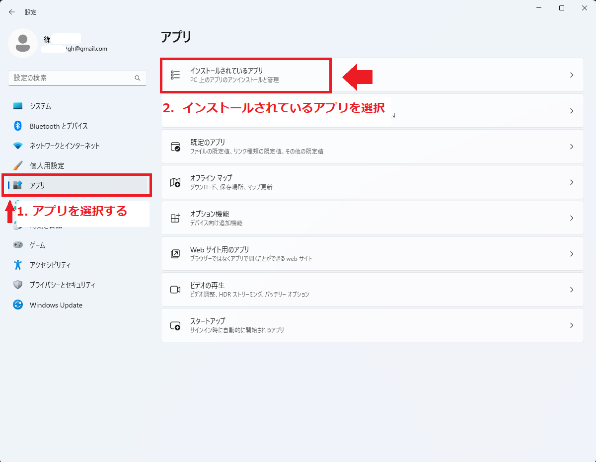
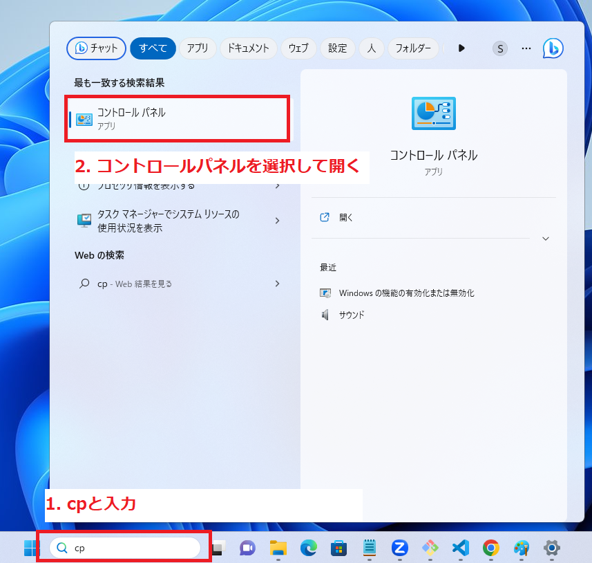
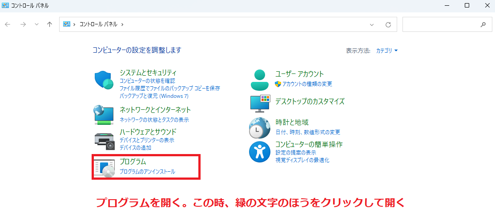
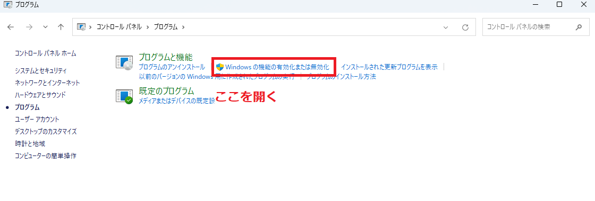

# wsl完全削除手順

## 手順1
- Linuxディストリビューションの削除  
- 追加のコンポーネントをアンインストール
- プラットフォームを無効にする  

1. windows11でwslをアンインストールする  
2. Windows Subsystem for Linuxをアンインストールする．この時
最初：ディストリビューション、カーネル更新プログラム、残りのコンポーネントを削除する  

3. Linuxディストリビューションを削除する  
4. Linux コンポーネント用の Windows サブシステムを削除する  
5. Windows 11 からプラットフォームをアンインストールできる  
6. Windows 11 から WSL を削除する  

## windows11でwslをアンインストールする  

　　

　　

   
  
確認が表示される．  
アンインストールの場合は再度アンインストールを押す  
  

上記と同様の手順で検索バーに`linux`と入力し，以下の2点をアンインストールする    
`Windows Subsystem for Linux Update`をアンインストール  
`WLinux用Windowsサブシステム`をアンインストール  

次に検索バーニ`cp`と入力し，コントロールパネルを開く  
  

  
  
## 参考文献    
[Windows 11 で WSL をアンインストールする方法,参考2023年5月25日](https://cloudo3.com/ja/windows/windows-11-%E3%81%A6%E3%82%99-wsl-%E3%82%92%E3%82%A2%E3%83%B3%E3%82%A4%E3%83%B3%E3%82%B9%E3%83%88%E3%83%BC%E3%83%AB%E3%81%99%E3%82%8B%E6%96%B9%E6%B3%95/11241537)  
[pdf版:windows11でWSLをアンインストールする方法](./pdf/Windows%2011%20%E3%81%A7%20WSL%20%E3%82%92%E3%82%A2%E3%83%B3%E3%82%A4%E3%83%B3%E3%82%B9%E3%83%88%E3%83%BC%E3%83%AB%E3%81%99%E3%82%8B%E6%96%B9%E6%B3%95.pdf)  
